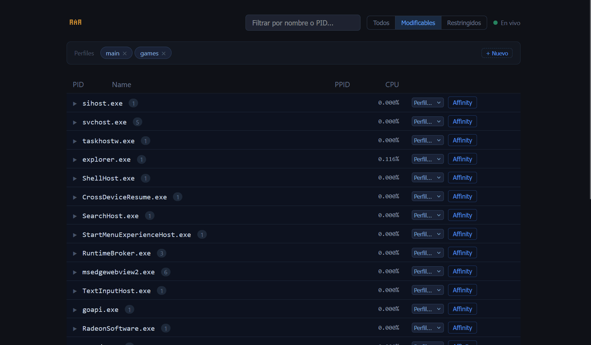

# GoAPI — CPU Affinity Manager

A Windows desktop application to monitor running processes and manage CPU core assignments through a local web interface.




## Features

- Real-time process list with CPU usage monitoring
- Assign specific CPU cores to any process (affinity mask)
- Save named profiles (e.g. "games", "background") and reuse them
- Auto-watcher: automatically applies a profile whenever a matching process starts
- System tray integration — runs quietly in the background
- Dark-themed web UI, no external dependencies

## Requirements

- Windows 10/11
- Go 1.21+ (to build from source)
- Run as Administrator (required to modify process affinity)

## Build & Run

```bat
go build -ldflags "-H windowsgui" -o goapi.exe .
goapi.exe
```

Or use the included dev script (kills any running instance, rebuilds, and launches):

```bat
dev.bat
```

The app starts a local server on `http://localhost:8080` and adds an icon to the system tray.

## Usage

1. Open `http://localhost:8080` in your browser (or click **Abrir en browser** from the tray icon).
2. Browse the process list — use the filter to show only restricted processes.
3. Click a process row to open the core selector and apply an affinity mask.
4. Create named **profiles** in the right panel and assign processes to them.
5. Assigned processes are automatically re-pinned to their profile on every restart.

## API Endpoints

| Method | Path | Description |
|--------|------|-------------|
| GET | `/health` | Health check |
| GET | `/system` | CPU core count |
| GET | `/processes` | List all processes |
| GET | `/processes/{pid}/affinity` | Get affinity mask |
| PUT | `/processes/{pid}/affinity` | Set affinity mask |
| GET | `/profiles` | List profiles |
| POST | `/profiles` | Create/update profile |
| DELETE | `/profiles/{name}` | Delete profile |
| GET | `/assignments` | List process→profile assignments |
| POST | `/assignments` | Save assignment |
| GET | `/ws/processes` | WebSocket: live process stream |

## Data Storage

Profiles and assignments are stored as JSON files (`profiles.json`, `assignments.json`) in the same directory as the executable.

## License

[MIT](LICENSE)

---

*Built with the assistance of AI agents.*
